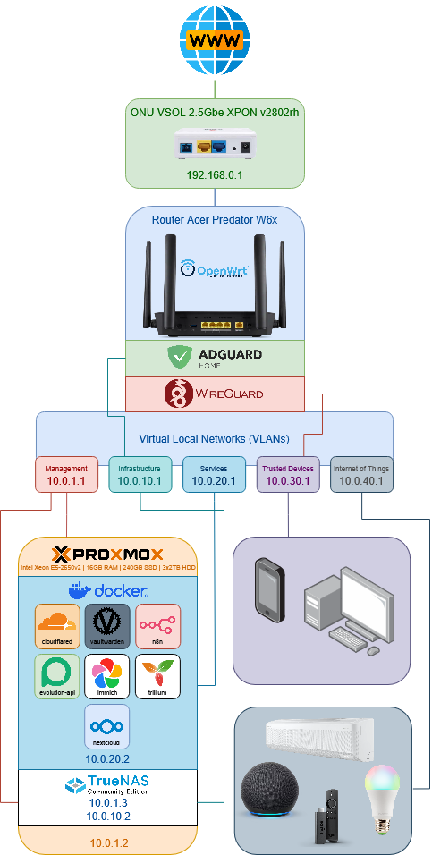

# 🏠 Homelab
🇺🇸 English | [🇧🇷 Português (BR)](./docs/README-PT_BR.md)


Welcome to my homelab project!
This is where I organize all the infrastructure, services, and automations that run locally with a focus on **control, privacy, and independence**.

> 💡 The idea is simple: **stop relying on Big Tech and run everything at home.**

---

## 🧭 Architecture



My network is segmented into VLANs for isolation and security:

| Network        | Subnet       | Function                    |
| -------------- | ------------ | --------------------------- |
| Management     | 10.0.1.0/24  | Administrative access       |
| Infrastructure | 10.0.10.0/24 | DNS, proxy, storage         |
| Services       | 10.0.20.0/24 | Applications                |
| Trusted        | 10.0.30.0/24 | Personal devices            |
| IoT            | 10.0.40.0/24 | IoT devices                 |

---

## 🧱 Core Stack

### 🖥️ Host

* **Proxmox** - Primary virtualization
* **TrueNAS VM** - Central storage (NFS/SMB)

### 🌐 Network

* **OpenWrt** - Router + Firewall
* **AdGuard Home** - DNS + Ad blocking
* **WireGuard** - Routes all traffic from the Trusted VLAN to a VPN

---

## 🐳 Services

All services run via Docker:

```bash
/services
├── cloudflared     # Tunnel for external access
├── evolution-api   # Custom API
├── immich          # Photos (Google Photos replacement)
├── n8n             # Automation
├── nextcloud       # Personal cloud
├── trilium         # Notes
└── vaultwarden     # Password manager
```

---

## 🚀 Goals

* [x] Complete local infrastructure
* [x] Replace cloud services
* [x] Deployment automation
* [ ] Improve observability (Prometheus/Grafana)

---

> "If you aren't paying for the product, you are the product."

---

## 📜 License

This project is licensed under the MIT License.
Feel free to use this repository as a foundation for your own homelab.
