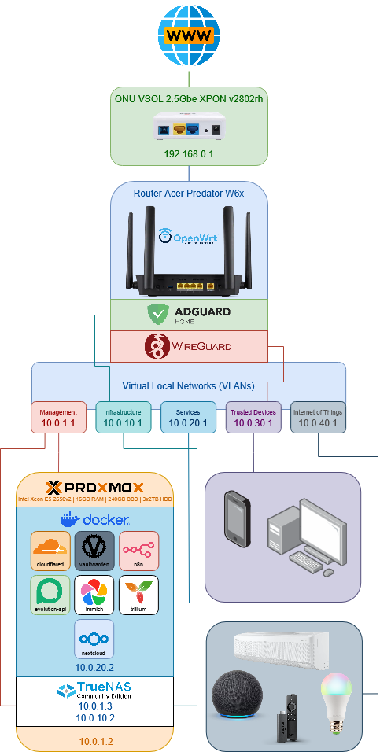

# 🏠 Homelab
🇺🇸 English | [🇧🇷 Português (BR)](./docs/README-PT_BR.md)

Welcome to my homelab project!
This is where I organize all the infrastructure, services, and automations that run locally with a focus on **control, privacy, and independence**.

> 💡 The idea is simple: **stop relying on Big Tech and run everything at home.**

---

## 🧭 Architecture

My network is segmented into VLANs for isolation and security:

| Network        | Subnet       | Function                    |
| -------------- | ------------ | --------------------------- |
| Management     | 10.0.1.0/24  | Administrative access       |
| Infrastructure | 10.0.10.0/24 | DNS, proxy, storage         |
| Services       | 10.0.20.0/24 | Applications                |
| Trusted        | 10.0.30.0/24 | Personal devices            |
| IoT            | 10.0.40.0/24 | IoT devices                 |

---

## 🧱 Core Stack

### 🖥️ Host

* **Debian** - bare metal, Docker straight on the host, no hypervisor
* **ZFS over SMB** - central storage, on a machine of its own

### 🌐 Network

* **OpenWrt** - Router + Firewall
* **AdGuard Home** - DNS + Ad blocking
* **WireGuard** - Routes all traffic from the Trusted VLAN to a VPN

---

## 🐳 Services

All services run via Docker, split across three hosts:

Caddy, Gatus, Homepage and Prometheus ship a `.example` config. The live ones list
services defined in other repos, so they are kept private alongside the host material.

### Server — `10.0.10.3`

| Service | Purpose |
| --- | --- |
| `evolution-api` | Open source WhatsApp API |
| `gitea` | Self-hosted git |
| `homeassistant` | Home automation |
| `homebox` | Inventory tracker |
| `homepage` | Dashboard |
| `immich` | Photos (Google Photos replacement) |
| `jellyfin` | Media server |
| `monitoring` | Prometheus + Grafana |
| `n8n` | Automation |
| `nextcloud` | Personal cloud |
| `paperless-ngx` | Document scanning and OCR |
| `redis-shared` | Shared Redis instance |
| `rsshub` | RSS feed generator |
| `searxng` | Metasearch engine |
| `trilium` | Notes |

### Router — `10.0.10.1` (OpenWrt)

| Service | Purpose |
| --- | --- |
| `caddy` | Reverse proxy — `docker-compose.router.yml` |
| `cloudflared` | Tunnel for external access — `docker-compose.router.yml` |
| `gatus` | Uptime monitoring — `docker-compose.router.yml` |
| `vaultwarden` | Password manager |

Kept on the router so external access and the vault survive a server reboot.

### Workstation

| Service | Purpose |
| --- | --- |
| `frigate-remote` | NVR for the camera, kept off the server |
| `immich-ml-remote` | Immich machine learning, offloaded from the server |

> Host-specific recovery scripts, boot-order workarounds and incident
> write-ups are deliberately **not** in this repo — they live in a separate
> private one.

---

## 🚀 Goals

* [x] Complete local infrastructure
* [x] Replace cloud services
* [x] Deployment automation
* [ ] Improve observability (Prometheus/Grafana)

---

> "If you aren't paying for the product, you are the product."

---

## 📜 License

This project is licensed under the MIT License.
Feel free to use this repository as a foundation for your own homelab.
